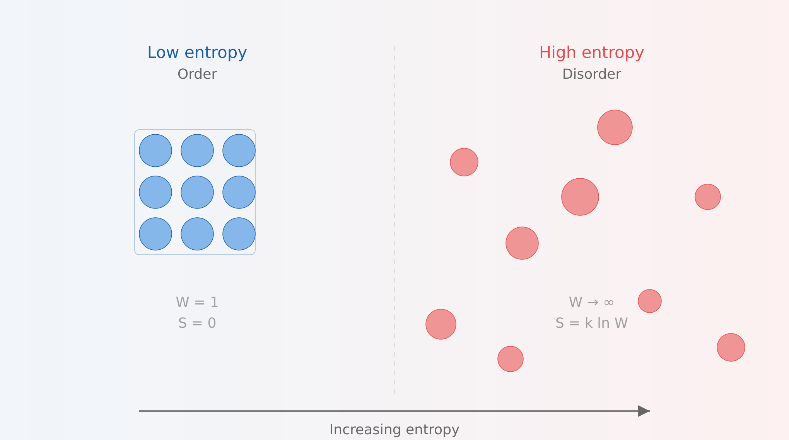
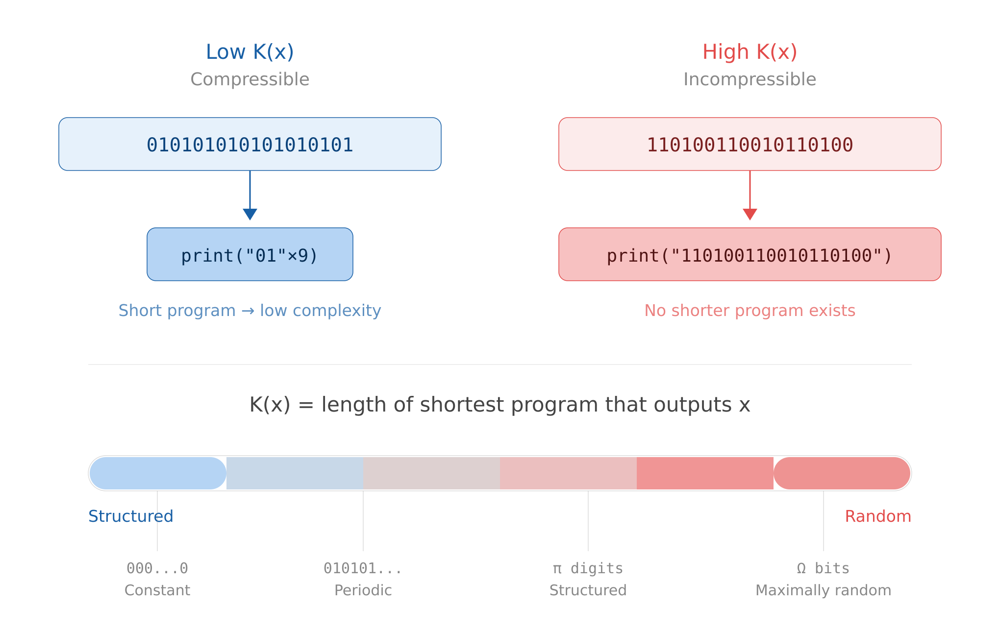
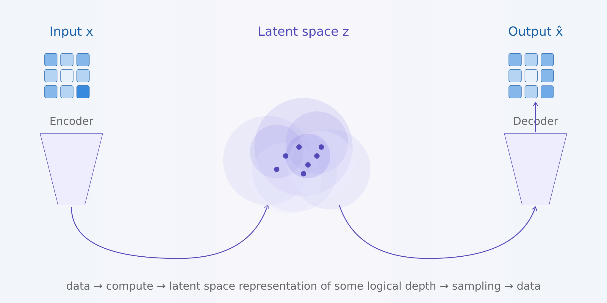
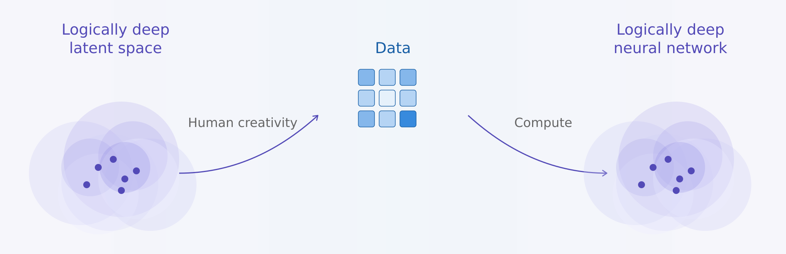

In this post I briefly introduce how we can use Charles Bennett's logical depth as a general framework to understand neural networks. I find it incredibly rich, and one can apply it in many interesting ways when thinking about the training pipeline and interpretability.

## **Intro \- entropy and Kolmogorov complexity**

If one were to try to mathematically describe a neural network, neither entropy nor Kolmogorov complexity seem sufficient.

Entropy could be described as a measure of average surprise. Order is, on average, very unsurprising, because we can easily predict where the particles are located (assuming a physics metaphor). Disorder is on average surprising, because we can never really predict where the next particle will show up. Neither end of the spectrum of entropy, order or disorder, seems to capture the intelligence that is contained within a neural network.

Kolmogorov complexity, on the other hand, measures information content contained in a given string. It's defined as "the length of the shortest possible computer program that could produce some string".

So the less a string is reducible to a computer program, the more Kolmogorov complex it is. This feels like it's getting towards something more descriptive of neural networks. However, a fully random string has maximal Kolmogorov complexity. So we can measure "non-recreateability" (which in my opinion has some signal, and could plausibly be a measure of intelligence), but we cannot determine whether it's purely random or high-signal information, solely based on Kolmogorov complexity. Note that pi has lower K complexity than a random string. We want something that would score pi higher than randomness, and probably higher than a simple \`print("01"x9)\` program as well.

## **Logical depth by Charles Bennett**

I propose [logical depth](https://www.academia.edu/116589715/Logical_Depth_and_Physical_Complexity) as a framework for understanding neural networks. From the abstract:

Some mathematical and natural objects (a random sequence, a sequence of zeros, a perfect crystal, a gas) are intuitively trivial, while others (e.g. the human body, the digits of π) contain internal evidence of a nontrivial causal history. We formalize this distinction by defining an object's "logical depth" as the time required by a standard universal Turing machine to generate it from an input that is algorithmically random.

Now that's a definition\! A neural network certainly has a non-trivial causal history \- all the hyperparameter tuning by thousands of researchers over the years, and, in the case of LLMs, the entire internet and the sum of human knowledge\! And the compute required to train it, it's a massive amount of GPU-time required to generate a logically deep object.

Notice, there is a certain transitivity here, as an LLM was created from already logically deep objects. The definition says "to generate it from an input that is algorithmically random". The internet and the RL environments are certainly not algorithmically random. The neural networks inherit the logical depths of the objects that preceded them.

Bennett formalizes the Slow Growth Law, but here we will satisfy ourselves with Claude's description:

> You can't take a simple (shallow) input and quickly transform it into something deep. If the output is deep, then either the input was already deep (carried the complexity with it), or the computation took a long time. Depth can't be created faster than it's "earned" through computation.

The most powerful NNs come from a combination of 1\. a logically deep training environment and 2\. the amount of compute invested inside that environment.

(Note \- these are very loose applications of logical depth to NNs, I propose this as a useful mental model, not a rigorous explanation.)

## **Training, through the lens of logical depth**

From [Chinchilla scaling laws](https://arxiv.org/abs/2203.15556) we learned that there is a ratio of training compute and model size which is cost optimal. However, one *can* keep pushing the amount of training data up and keep getting results, it's just that the returns start diminishing. This means that there is something irreducible about the compute/training time.

When looking at the current training landscape, synthetic pretraining comes to mind. It's basically saying "we gotta keep pushing the training data up", which is, again, a combination of increasing the compute time and increasing the amount of baseline logical depth on which the model is trained on.

One can also think about RL environments in a similar vein. How can one produce an RL environment, where when a model interacts with it, the output is increasing the logical depth of the model? I think of it as the inverse of a variational autoencoder (VAE).

A VAE uses a certain amount of compute to encode given data into a compressed representation, where this representation presumably contains some logical depth, and then samples from it to create more data of a similar structure.

The inverse of this is fun\! We have to come up with an environment (which came from our logically deep imagination :P), which, when a certain program is run, produces training data. A simple RL environment fits this description (where training data \= interactions/rewards in the environment). These generated samples are then recompressed into a completely new latent representation inside the model \- whether it's through interaction with the env, or through ingesting synthetic data which we generated.

The goal is to take our understanding of the world, create an environment of high logical depth and through it generate samples for the NN to learn from. "Human creativity" in the diagram can refer to human created games, for example. The model could learn to interact with the environment, or to predict the next state, depending on what is being trained, but what is relevant here is that the new latent space being learned is based on the high logical depth of the environment. I would argue this framework encapsulates the transfer of knowledge from humans to machines.

Something like Minecraft seems to really capture this idea. A certain amount of computation is invested to procedurally generate the environment in the first place, thus buying some logical depth, based on some initial human designed rules, which also contain depth. Agents in that environment are then interacting with something rich, and are able to learn a different representation/understanding of the environment than what generated it, yet still compress it successfully from a different vantage point.

This "inverse VAE" idea seems to me reminiscent of sparse autoencoders (SAE) as well.

## **Intelligence as compression versus generation**

My "aha\!" moment when I discovered logical depth came from thinking about training environments. How can one "generate more from less" when it comes to training data?

My thinking, paraphrased:

This is the inverse of "intelligence as compression". This is, sort of, intelligence as "generation". Generation is not the exact inverse of compression, because generation can create new emergent rich patterns that original compression is not sufficient enough to capture. So there are things like laws of physics, or procedural rules, which are compressed to a degree, but not a "sufficient" descriptor of the full output.

Through a few conversations with Claude I came to logical depth as a concept which describes my intuition perfectly:

> Logically deep objects are precisely the ones that are interesting for training — they have structure (they're not random), but the structure is nontrivial (it can't be trivially generated). A random string has high Kolmogorov complexity but zero logical depth. A trivially repetitive string has low complexity and low depth. The interesting sweet spot — physics simulations, RL trajectories, complex games — has low complexity but high logical depth. That might be the formalization your intuition is reaching for.

## **Interpretability**

From a Github gist, [Open problems in mechanistic interpretability: 2026 status report](https://gist.github.com/bigsnarfdude/629f19f635981999c51a8bd44c6e2a54):

**Computational costs** remain prohibitive: Nanda's DeepMind team used "20 petabytes of storage and GPT-3-level compute just for Gemma 2 SAEs." Production monitoring must be cheap—"if you make running Gemini twice as expensive, you have just doubled the budget Google needs."

**Labor intensity** compounds the challenge: "It currently takes a few hours of human effort to understand the circuits we see, even on prompts with only tens of words," Anthropic reported. Automated interpretability pipelines using LLMs to explain LLMs raise the concern of "black box interpreting black box," and hallucinated explanations are common.

Some bold claims I could make: There is no way of cheating logical depth. To interpret a network fully would require inordinate amounts of compute, equivalent or larger to training compute.

Of course, there are inefficiencies in training, and the training process is probably not the minimal program we can find to generate a deep neural network. But it is the best one we have. And given the amount of resources invested in interpretability versus making better models, I would say we are far better at tuning the hyperparameters of training rather than interpretability.
