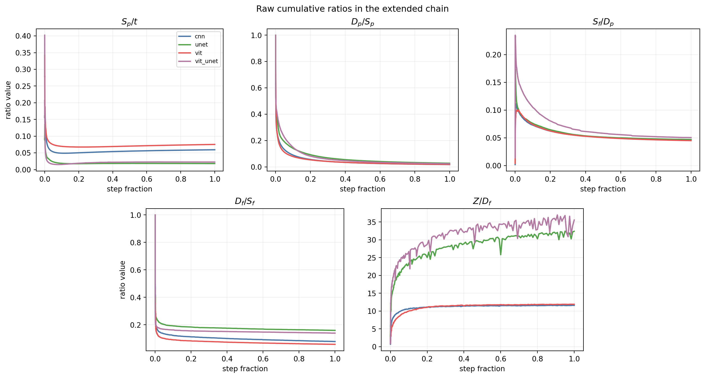

## Intro

In this post I introduce an analytic way of looking at training: a set of "accounting" equations that connect what happens during training without going into the mechanics of it. No matmul, no circuits, only n-dimensional spaces where dots move around. Simple calculus and Euclidean geometry, purely observational.

The first clue is that there should be an equation which connects the following:
- training step
- parameter movement
- model output movement
- loss reduction

Turns out, it's fairly simple, and it gives us a clear overview of training.

The identities in this post were derived by Chatgpt Pro 5.4 and 5.5, some more and some less directed by me. It mostly took my stream of thought about training dynamics and what I wanted to measure, and converted it into equations.

Note, this post is fully human written, and lends itself to easy conversational reading. If anything is unclear I recommend pasting it into an LLM of choice.

## Main identities

We consider $\theta$ as a set of all params, and we put it in n-dimensional space, each param occupying one dimension. We do the same for the model's output, where each output dimension (e.g. each reconstruction pixel) is placed on one axis of an n-dimensional space. So then a distance in param movement, or model output (functional) movement, is simply Euclidean distance in its own space.

We define $x(t)$ as relative progress per step, for any loss function $L$:

$$
x(t) = \frac{\Delta L(t)}{L(t)}
$$

rearranging we also achieve:

$$
L(t+1) = L(t)(1 - x(t))
$$

This is fairly intuitive, as each step is a percentage reduction of a previous loss. So cumulatively:

$$
L(t) = L(0)\prod_{u < t}(1 - x(u))
$$

Then we can also put progress on a log scale, so it accumulates additively rather than multiplicatively over time:

$$
Z(T) = \sum_{t < T} -\log(1 - x(t))
$$

So e.g. a step that halves the loss ($x = 0.5$) contributes 0.693 to $Z$; a step that removes 90% of loss contributes 2.3. 

Equivalently:

$$
L(T) = L(0)\exp(-Z(T))
$$

So we just express the decay via an exponential. Note that $Z$ is not constant, so the exponent changes over time, giving interesting forms to the curve.

To sanity check the equation, I did image autoencoding on a few small archs and datasets, and verified the equations. I calculated $L(0)e^{-Z}$ vs observed loss and verified the sides are the same to machine precision.

The equation itself is mostly a tautology, and not particularly revealing. However, I think framing it via an "exponential decay with an exponent which depends on relative progress at each step" is novel. 

It's an equation which naturally yields itself to explain power-law-like decays we usually observe empirically, and here it's derived mathematically. This is related to the Weibull form in my previous paper. One could set up a situation where $Z$ modifies over time with a certain regularity which then leads to a clean description of the observed Weibull curves.

So, if $Z(s) = const*s^{\beta}$, then we get:

$$
L(s) = L(0)\exp(-const\*s^{\beta})
$$

This is a Weibull (i.e. a stretched exponential) which is what we usually observe during training. In my [paper](/assets/papers/key_search_resolution_bands.pdf), I demonstrate that we observe it during image autoencoding training. 

Note that the equations actually work irrespective of how loss is defined.

## Training kinematics

Now, we can proceed to break down this equation into more detail. Consider the following:

- Training step: $t$
- Parameter arc length:

$$
S_p(T) = \sum_{t < T} \lVert \theta_{t+1} - \theta_t \rVert
$$

This is the total movement of the parameters in the n-dimensional space
- Parameter displacement:

$$
D_p = \lVert \theta_T - \theta_0 \rVert
$$

Because the arc length is winding, a crow-flight connection from the start to the final point is also interesting to observe in contrast to the full arc.

We then apply the same logic to observe model outputs in n-dimensional space:

- Functional (model output) arc length:

$$
S_f(T) = \sum_{t < T} \lVert f_{\theta(t+1)}(x) - f_{\theta(t)}(x) \rVert
$$

- Functional displacement:

$$
D_f = \lVert f_T(x) - f_0(x) \rVert
$$

And finally all of these should add up to training progress:

- Log progress:

$$
Z = \sum -\log(1 - x(t))
$$

So there is a chain: $t \to S_p \to D_p \to S_f \to D_f \to Z$.

So what we do is factorize $Z$ into these values.

$$
Z = t \cdot \frac{S_p}{t} \cdot \frac{D_p}{S_p} \cdot \frac{S_f}{D_p} \cdot \frac{D_f}{S_f} \cdot \frac{Z}{D_f}
$$

| Ratio       | Meaning                                         |
|-------------|--------------------------------------------------|
| $S_p / t$     | Parameter distance per training step            |
| $D_p / S_p$   | Parameter path straightness                      |
| $S_f / D_p$   | Functional distance per unit param displacement |
| $D_f / S_f$   | Functional path straightness                     |
| $Z / D_f$     | Log-progress per unit functional displacement |

Again, somewhat tautological, but it gives a clean global view of training. There are a lot of papers e.g. working with parameter curvature, manifolds, movement, etc. and likewise a lot of papers working with functional movement and geometries, so this kind of gives a unifying big picture. 

Plot:



To at least motivate a little bit why this is interesting, let's look at one the plots. On the x axis of all the plots is training step fraction from 0 to 1. On the y axis is each respective ratio. Each ratio is cumulative. For example, we can look at param displacement over param arc length ($D_p/S_p$), which is parameter path straightness. At step 1, trivially, the path is fully straight, but then the ratio sharply drops and stalls, meaning, the wandering continues as a roughly constant value for the rest of the training, and never straightens (low straightness value). 

While descriptive, so far I haven't found a way in which the kinematics view is predictive, i.e. using something like $D_p/S_p$ to predict future loss. Using any of the quantities to predict future loss doesn't help more than just using momentary loss itself.

## Conclusion

The generative process behind these plots and equations is probably where all the meat is at. However, here we at least have a nice big analytic picture of training. How the log progress and kinematics equations end up being useful is an open question, and I have some ways I'm trying to use this framework further.

```bibtex
@misc{jukic2026analytic,
  author    = {Jurij Jukić},
  title     = {Analytic View of Training},
  year      = {2026},
  publisher = {Zenodo},
  doi       = {10.5281/zenodo.20560475},
  url       = {https://doi.org/10.5281/zenodo.20560475}
}
```
